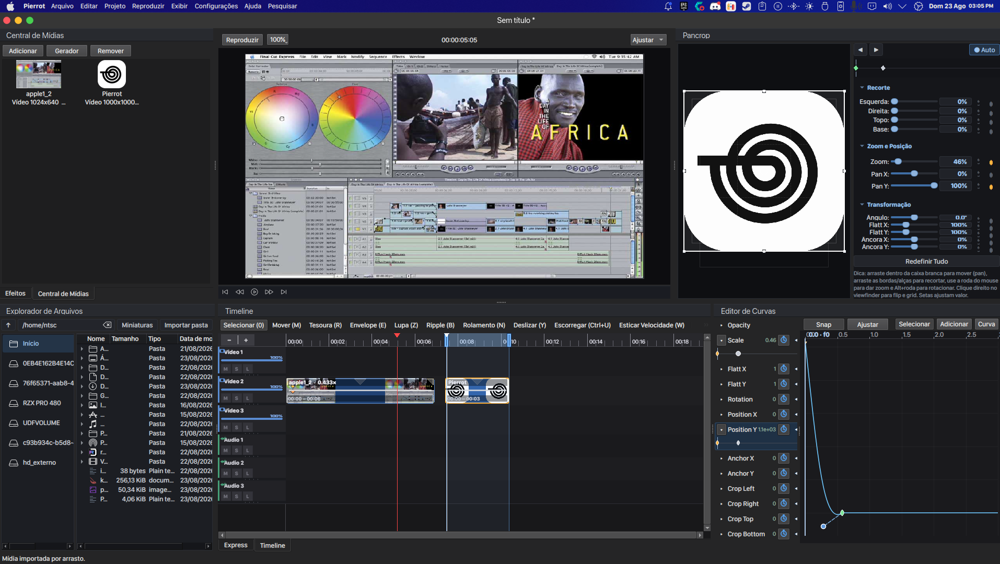

# Pierrot v0.4.2 alpha

Editor de vídeo simples — O estilo vem do **Sony Vegas Pro** e **Final Cut Express (2003)**,
desenvolvido **exclusivamente para Linux**, escrito em
**C++** com **Qt Widgets** e **FFmpeg** (decodificação em processo + exportação via CLI).

A ideia do editor é: ser otimizado e ter um fluxo de trabalho rápido,
pra vídeos sem complexidade, focado no YouTube e outras plataformas.



## Especificações

| Item                | Detalhe                                                     |
|---------------------|-------------------------------------------------------------|
| Formato de projeto  | `.Blanc`;                      |
| Exportação          | MP4 (H.264/AAC), MKV (H.264/AAC), WebM (VP9/Opus)          |
| Resolução           | configurável (padrão 1920×1080)                             |
| Quadros/s           | configurável (padrão 30)                                    |
| Taxa de áudio       | 48 kHz (exportação)                                         |
| Efeitos por clipe   | volume, opacidade, velocidade, fades, texto, brilho, contraste, saturação, desfoque, P&B, chroma key + plugins OFX |
| Blend por faixa     | 12 modos + opacidade de faixa (0–100%)                      |
| Zoom da timeline    | 2 px/s – 4000 px/s                                          |
| Fonte               | C++ (Qt Widgets) + FFmpeg (libav*)                          |

Para a lista completa de funcionalidades, veja **[FEATURES.md](FEATURES.md)**.

## Dependências (Ubuntu/Debian)

```bash
sudo apt install cmake g++ pkg-config \
    qt6-base-dev qt6-multimedia-dev \
    libavformat-dev libavcodec-dev libavutil-dev libswscale-dev libswresample-dev
```

Se usar Qt 5 em vez de Qt 6: substitua `qt6-base-dev` por `qtbase5-dev`,
`qt6-multimedia-dev` por `qtmultimedia5-dev`.

## Compilar

```bash
cd Pierrot
cmake -B build -DCMAKE_BUILD_TYPE=Release
cmake --build build -j$(nproc)
./build/pierrot
```

O binário também precisa do `ffmpeg` no `PATH` para exportar (qualquer distro).

## AppImage (distribuição portátil)

Para gerar um AppImage único e portátil (Qt + libs FFmpeg + o próprio `ffmpeg`
embutidos), na sua máquina com as dependências instaladas:

```bash
packaging/build-appimage.sh
```

O resultado fica em `dist/Pierrot-<versão>-<arquitetura>.AppImage`. Rode com:

```bash
chmod +x dist/Pierrot-*.AppImage
./dist/Pierrot-*.AppImage
```

O script baixa o `linuxdeploy` na primeira execução e usa o `qmake` do Qt
instalado (`qmake6` ou `qmake`) para copiar os plugins Qt (platforms,
imageformats, iconengines) para dentro do AppImage, já com as dependências.
Variáveis opcionais:
`VERSION`, `OUT_DIR`, `BUNDLE_FFMPEG=0` (não embutir o ffmpeg) e
`UPDATE_INFORMATION` para embutir a string de atualização do **AppImageUpdate**
(ex.: `gh-releases-zsync|usuario|repo|latest|Pierrot-*-x86_64.AppImage.zsync`,
o `.zsync` correspondente também é movido para `dist/`).

## Como usar

1. Clique em **Adicionar** no painel Mídia e escolha seus arquivos.
2. Arraste um item da lista para uma faixa de vídeo (ou áudio) na timeline.
3. Mova a régua (clique na parte superior) para posicionar o playhead.
4. `S` divide o clipe na posição do playhead; `Delete` remove o selecionado.
5. **Arquivo → Exportar…** (Ctrl+E) para gerar o vídeo final.

## Roadmap

- [ ] **Versão para macOS** — levar o Pierrot para quem edita no Mac.

> O foco continua sendo o Linux: a versão para Mac é um plano futuro.

## Licença

Pierrot é um software livre: você pode redistribuí-lo e/ou modificá-lo sob os
termos da **GNU General Public License versão 3** ou (a seu critério) qualquer
versão posterior, conforme publicado pela Free Software Foundation.

Este programa é distribuído na esperança de que seja útil, mas **SEM QUALQUER
GARANTIA**; sem sequer a garantia implícita de comercialização ou adequação a
um propósito específico. Veja a GNU GPL para mais detalhes.

- Texto completo da licença: [LICENSE](LICENSE) (GPL-3.0).
- Copyright (C) 2026 **theinkspoty**.
