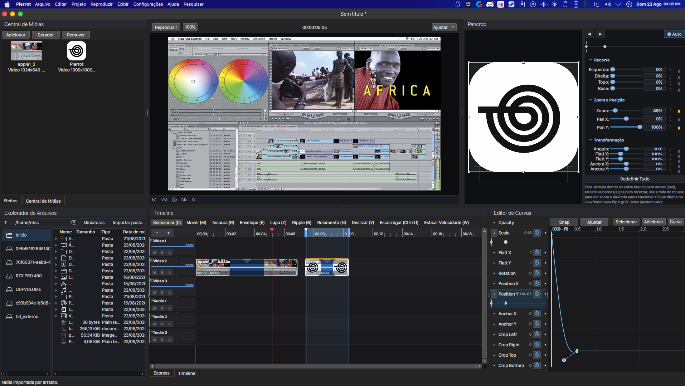

# Pierrot v0.7 alpha

> **Este app é para uso pessoal.** Não é distribuído, não tem suporte, não tem garantia.
> O código é o que é — funciona pra mim, e é isso.

Editor de vídeo simples — O estilo vem do **Sony Vegas Pro** e **Final Cut Express (2003)**,
desenvolvido **exclusivamente para Linux**, escrito em
**C++** com **Qt Widgets** e **FFmpeg** (decodificação em processo + exportação via CLI).

A ideia do editor é: ser otimizado e ter um fluxo de trabalho rápido,
pra vídeos sem complexidade, pra uso meu.



## Especificações

| Item                | Detalhe                                                     |
|---------------------|-------------------------------------------------------------|
| Formato de projeto  | `.Blanc` (JSON; salvamento assíncrono + backup rotativo)    |
| Exportação          | MP4 (H.264/AAC), MKV (H.264/AAC), WebM (VP9/Opus)          |
| Resolução           | configurável (padrão 1920×1080)                             |
| Quadros/s           | configurável (padrão 30)                                    |
| Taxa de áudio       | 48 kHz (exportação)                                         |
| Correção de cor     | Lumetri por clipe: exposição, realces/sombras/brancos/pretos, sat/vibrance, temperatura/tint, Lift/Gamma/Gain, curvas RGB, vinheta, LUT `.cube`, nitidez |
| Efeitos por clipe   | vídeo: brilho, contraste, saturação, desfoque, P&B, chroma key, máscaras, motion blur, texto, LAINKA + hosts **OFX** e **frei0r**; áudio: EQ Express e Reverb EX |
| Fluxo de edição     | Source Monitor (In/Out, Insert/Overwrite), **multicâmera** (teclas 1..N), **Editor de Velocidade** (time remapping bezier) |
| Mesa (composição)   | camadas com transform/blend + câmera e malha `.obj` (3D leve) |
| Blend por faixa     | 12 modos + opacidade de faixa (0–100%)                      |
| Zoom da timeline    | 2 px/s – 4000 px/s                                          |
| Fonte               | C++ (Qt Widgets) + FFmpeg (libav*)                          |

Para a lista completa de funcionalidades, veja **[FEATURES.md](FEATURES.md)**;
para as novidades de cada versão, veja **[CHANGELOG.md](CHANGELOG.md)**.

## Dependências (Ubuntu/Debian)

```bash
sudo apt install cmake g++ pkg-config \
    qt6-base-dev qt6-multimedia-dev \
    libavformat-dev libavcodec-dev libavutil-dev libswscale-dev libswresample-dev
```

Se usar Qt 5 em vez de Qt 6: substitua `qt6-base-dev` por `qtbase5-dev`,
`qt6-multimedia-dev` por `qtmultimedia5-dev`.

> **Qt6 é requisito.** O código usa APIs que só existem no Qt6 e não compila com Qt5.

## Compilar

```bash
cd Pierrot
cmake -B build -DCMAKE_BUILD_TYPE=Release
cmake --build build -j$(nproc)
./build/pierrot
```

O binário também precisa do `ffmpeg` no `PATH` para exportar (qualquer distro).

## Como usar

1. Clique em **Adicionar** no painel Mídia e escolha seus arquivos.
2. Arraste um item da lista para uma faixa de vídeo (ou áudio) na timeline.
3. Mova a régua (clique na parte superior) para posicionar o playhead.
4. `S` divide o clipe na posição do playhead; `Delete` remove o selecionado.
5. **Arquivo → Exportar…** (Ctrl+E) para gerar o vídeo final.

## Licença

Pierrot está sob a **GPL-3.0**. É uso pessoal, mas o código é aberto — se
alguém quiser forkar, é só fazer.

- Texto completo: [LICENSE](LICENSE) (GPL-3.0).
- Copyright (C) 2026 **theinkspoty**.
